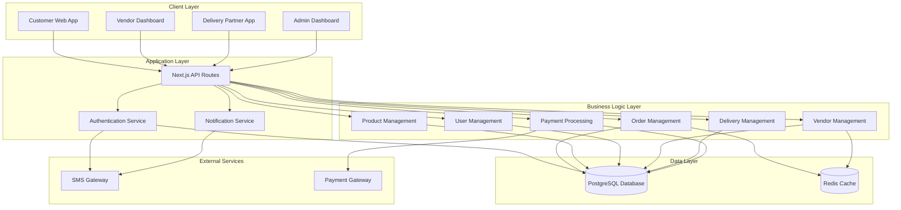

# Design Document: Multi-Vendor Marketplace Platform

## Overview

The multi-vendor marketplace platform is a web-based application built with Next.js 14+ (App Router), TypeScript, Prisma ORM, and PostgreSQL. The system enables customers to browse vendors across multiple categories (food, clothing, fruits & vegetables), place orders, and track deliveries within defined service areas. The platform supports four distinct user roles: customers, vendors, delivery partners, and super administrators.

The architecture follows a modular, role-based design with clear separation of concerns. The system uses server-side rendering for public pages, API routes for backend operations, and real-time updates for order tracking and notifications.

## Architecture

### High-Level Architecture



### Technology Stack

- **Frontend**: Next.js 14+ (App Router), React 18+, TypeScript, Tailwind CSS, shadcn/ui
- **Backend**: Next.js API Routes, TypeScript
- **Database**: PostgreSQL with Prisma ORM
- **Caching**: Redis (for session management and frequently accessed data)
- **Authentication**: JWT tokens with bcrypt for password hashing
- **State Management**: Redux Toolkit (for complex client state)
- **Validation**: Zod schemas
- **SMS Gateway**: Twilio or similar service for OTP delivery
- **Payment Gateway**: Razorpay or Stripe (India-compatible)

### Deployment Architecture

- **Hosting**: Vercel or similar serverless platform
- **Database**: Managed PostgreSQL (AWS RDS, Supabase, or similar)
- **Cache**: Managed Redis (Upstash, Redis Cloud)
- **File Storage**: AWS S3 or Cloudinary (for product images)

## Components and Interfaces

### 1. Authentication Module

**Responsibilities:**
- User registration and login
- Dual authentication (username/password and mobile OTP)
- Session management
- Role-based access control

**Key Components:**
- `AuthService`: Handles authentication logic
- `OTPService`: Generates and validates OTPs
- `SessionManager`: Manages user sessions and tokens
- `RBACMiddleware`: Enforces role-based access

**API Endpoints:**
- `POST /api/auth/register` - User registration
- `POST /api/auth/login` - Username/password login
- `POST /api/auth/request-otp` - Request mobile OTP
- `POST /api/auth/verify-otp` - Verify OTP and login
- `POST /api/auth/logout` - Terminate session
- `GET /api/auth/session` - Get current session

### 2. User Management Module

**Responsibilities:**
- CRUD operations for all user types
- User profile management
- Address management for customers

**Key Components:**
- `UserService`: User CRUD operations
- `AddressService`: Customer address management
- `UserRepository`: Data access layer

**API Endpoints:**
- `GET /api/users` - List users (admin only)
- `GET /api/users/:id` - Get user details
- `PUT /api/users/:id` - Update user
- `DELETE /api/users/:id` - Deactivate user
- `POST /api/users/:id/addresses` - Add address
- `GET /api/users/:id/addresses` - List addresses
- `PUT /api/addresses/:id` - Update address

### 3. Vendor Management Module

**Responsibilities:**
- Vendor registration and approval
- Vendor profile and category management
- Operating hours configuration
- Vendor availability status

**Key Components:**
- `VendorService`: Vendor business logic
- `CategoryService`: Vendor category management
- `OperatingHoursService`: Hours management
- `VendorRepository`: Data access layer

**API Endpoints:**
- `GET /api/vendors` - List vendors (with filters)
- `GET /api/vendors/:id` - Get vendor details
- `POST /api/vendors` - Create vendor (admin)
- `PUT /api/vendors/:id` - Update vendor
- `PUT /api/vendors/:id/status` - Update availability
- `PUT /api/vendors/:id/operating-hours` - Set operating hours
- `GET /api/vendors/:id/orders` - Get vendor orders

### 4. Product Management Module

**Responsibilities:**
- Product catalog management
- Product availability tracking
- Product search and filtering

**Key Components:**
- `ProductService`: Product business logic
- `ProductRepository`: Data access layer
- `ProductSearchService`: Search and filter logic

**API Endpoints:**
- `GET /api/vendors/:vendorId/products` - List vendor products
- `GET /api/products/:id` - Get product details
- `POST /api/vendors/:vendorId/products` - Create product
- `PUT /api/products/:id` - Update product
- `DELETE /api/products/:id` - Delete product
- `PUT /api/products/:id/availability` - Update availability

### 5. Order Management Module

**Responsibilities:**
- Order creation and lifecycle management
- Cart management
- Order status tracking
- Order assignment to delivery partners

**Key Components:**
- `OrderService`: Order business logic
- `CartService`: Shopping cart management
- `OrderStatusService`: Status transitions
- `OrderRepository`: Data access layer

**API Endpoints:**
- `POST /api/orders` - Create order
- `GET /api/orders/:id` - Get order details
- `GET /api/orders` - List orders (filtered by user role)
- `PUT /api/orders/:id/status` - Update order status
- `POST /api/orders/:id/accept` - Vendor accepts order
- `POST /api/orders/:id/reject` - Vendor rejects order
- `POST /api/orders/:id/ready` - Mark order ready
- `GET /api/cart` - Get current cart
- `POST /api/cart/items` - Add item to cart
- `PUT /api/cart/items/:id` - Update cart item
- `DELETE /api/cart/items/:id` - Remove cart item

### 6. Delivery Management Module

**Responsibilities:**
- Delivery partner assignment
- Delivery status tracking
- Available delivery requests management

**Key Components:**
- `DeliveryService`: Delivery business logic
- `AssignmentService`: Partner assignment logic
- `DeliveryRepository`: Data access layer

**API Endpoints:**
- `GET /api/deliveries/available` - List available deliveries
- `POST /api/deliveries/:id/accept` - Accept delivery
- `PUT /api/deliveries/:id/pickup` - Mark as picked up
- `PUT /api/deliveries/:id/in-transit` - Mark in transit
- `PUT /api/deliveries/:id/delivered` - Mark delivered
- `PUT /api/deliveries/:id/issue` - Report delivery issue

### 7. Payment Module

**Responsibilities:**
- Payment processing
- Refund handling
- Payment method management

**Key Components:**
- `PaymentService`: Payment business logic
- `PaymentGatewayAdapter`: Integration with payment gateway
- `RefundService`: Refund processing

**API Endpoints:**
- `POST /api/payments/initiate` - Initiate payment
- `POST /api/payments/verify` - Verify payment
- `POST /api/payments/:id/refund` - Process refund
- `GET /api/payments/:orderId` - Get payment status

### 8. Service Area Module

**Responsibilities:**
- Geographic service area management
- Area-based vendor and customer filtering
- Service availability validation

**Key Components:**
- `ServiceAreaService`: Service area business logic
- `GeoValidationService`: Geographic validation
- `ServiceAreaRepository`: Data access layer

**API Endpoints:**
- `GET /api/service-areas` - List service areas
- `GET /api/service-areas/:id` - Get area details
- `POST /api/service-areas` - Create area (admin)
- `PUT /api/service-areas/:id` - Update area
- `POST /api/service-areas/validate` - Validate address

### 9. Notification Module

**Responsibilities:**
- Real-time notifications
- SMS notifications
- Email notifications (future)

**Key Components:**
- `NotificationService`: Notification orchestration
- `SMSService`: SMS delivery
- `NotificationRepository`: Notification history

**API Endpoints:**
- `GET /api/notifications` - List user notifications
- `PUT /api/notifications/:id/read` - Mark as read
- `POST /api/notifications/send` - Send notification (internal)

## Data Models

### User Model
```typescript
enum UserRole {
  CUSTOMER
  VENDOR
  DELIVERY_PARTNER
  SUPER_ADMIN
}

enum UserStatus {
  ACTIVE
  INACTIVE
  SUSPENDED
}

model User {
  id: string (UUID)
  email: string (unique)
  phone: string (unique)
  passwordHash: string (nullable for OTP-only users)
  role: UserRole
  status: UserStatus
  firstName: string
  lastName: string
  createdAt: DateTime
  updatedAt: DateTime
  
  // Relations
  addresses: Address[]
  orders: Order[]
  vendor: Vendor? (one-to-one)
  deliveryPartner: DeliveryPartner? (one-to-one)
  sessions: Session[]
  otps: OTP[]
}
```

### Vendor Model
```typescript
enum VendorStatus {
  PENDING_APPROVAL
  ACTIVE
  INACTIVE
  SUSPENDED
}

model Vendor {
  id: string (UUID)
  userId: string (foreign key)
  businessName: string
  category: VendorCategory (foreign key)
  description: string
  rating: decimal (0-5)
  totalOrders: integer
  status: VendorStatus
  serviceAreaId: string (foreign key)
  createdAt: DateTime
  updatedAt: DateTime
  
  // Relations
  user: User
  category: VendorCategory
  serviceArea: ServiceArea
  products: Product[]
  orders: Order[]
  operatingHours: OperatingHours[]
}
```

### VendorCategory Model
```typescript
model VendorCategory {
  id: string (UUID)
  name: string (e.g., "Food", "Clothing", "Fruits & Vegetables")
  description: string
  icon: string (URL or identifier)
  
  // Relations
  vendors: Vendor[]
}
```

### Product Model
```typescript
enum ProductStatus {
  AVAILABLE
  OUT_OF_STOCK
  DISCONTINUED
}

model Product {
  id: string (UUID)
  vendorId: string (foreign key)
  name: string
  description: string
  price: decimal (2 decimal places)
  imageUrl: string
  status: ProductStatus
  category: string
  createdAt: DateTime
  updatedAt: DateTime
  
  // Relations
  vendor: Vendor
  orderItems: OrderItem[]
  cartItems: CartItem[]
}
```

### Order Model
```typescript
enum OrderStatus {
  PENDING
  ACCEPTED
  PREPARING
  READY_FOR_PICKUP
  ASSIGNED_TO_DELIVERY
  PICKED_UP
  IN_TRANSIT
  DELIVERED
  CANCELLED
  REJECTED
}

model Order {
  id: string (UUID)
  orderNumber: string (unique, human-readable)
  customerId: string (foreign key)
  vendorId: string (foreign key)
  deliveryPartnerId: string (nullable, foreign key)
  deliveryAddressId: string (foreign key)
  status: OrderStatus
  subtotal: decimal
  deliveryFee: decimal
  tax: decimal
  total: decimal
  paymentId: string (foreign key)
  createdAt: DateTime
  updatedAt: DateTime
  
  // Relations
  customer: User
  vendor: Vendor
  deliveryPartner: DeliveryPartner
  deliveryAddress: Address
  items: OrderItem[]
  statusHistory: OrderStatusHistory[]
  payment: Payment
}
```

### OrderItem Model
```typescript
model OrderItem {
  id: string (UUID)
  orderId: string (foreign key)
  productId: string (foreign key)
  productName: string (snapshot)
  productPrice: decimal (snapshot)
  quantity: integer
  subtotal: decimal
  
  // Relations
  order: Order
  product: Product
}
```

### Cart and CartItem Models
```typescript
model Cart {
  id: string (UUID)
  customerId: string (foreign key)
  vendorId: string (foreign key)
  createdAt: DateTime
  updatedAt: DateTime
  
  // Relations
  customer: User
  vendor: Vendor
  items: CartItem[]
}

model CartItem {
  id: string (UUID)
  cartId: string (foreign key)
  productId: string (foreign key)
  quantity: integer
  
  // Relations
  cart: Cart
  product: Product
}
```

### DeliveryPartner Model
```typescript
enum DeliveryPartnerStatus {
  AVAILABLE
  BUSY
  OFFLINE
}

model DeliveryPartner {
  id: string (UUID)
  userId: string (foreign key)
  vehicleType: string
  vehicleNumber: string
  status: DeliveryPartnerStatus
  serviceAreaId: string (foreign key)
  totalDeliveries: integer
  rating: decimal (0-5)
  
  // Relations
  user: User
  serviceArea: ServiceArea
  orders: Order[]
}
```

### Address Model
```typescript
model Address {
  id: string (UUID)
  userId: string (foreign key)
  label: string (e.g., "Home", "Work")
  street: string
  landmark: string
  city: string
  state: string
  pincode: string
  isDefault: boolean
  createdAt: DateTime
  updatedAt: DateTime
  
  // Relations
  user: User
  orders: Order[]
}
```

### ServiceArea Model
```typescript
enum ServiceAreaStatus {
  ACTIVE
  INACTIVE
}

model ServiceArea {
  id: string (UUID)
  name: string (e.g., "Bagalakunte, Bangalore")
  city: string
  state: string
  pincodes: string[] (array of supported pincodes)
  status: ServiceAreaStatus
  createdAt: DateTime
  updatedAt: DateTime
  
  // Relations
  vendors: Vendor[]
  deliveryPartners: DeliveryPartner[]
}
```

### OperatingHours Model
```typescript
enum DayOfWeek {
  MONDAY
  TUESDAY
  WEDNESDAY
  THURSDAY
  FRIDAY
  SATURDAY
  SUNDAY
}

model OperatingHours {
  id: string (UUID)
  vendorId: string (foreign key)
  dayOfWeek: DayOfWeek
  openTime: string (HH:MM format)
  closeTime: string (HH:MM format)
  isClosed: boolean
  
  // Relations
  vendor: Vendor
}
```

### Payment Model
```typescript
enum PaymentStatus {
  PENDING
  PROCESSING
  COMPLETED
  FAILED
  REFUNDED
}

enum PaymentMethod {
  CARD
  UPI
  NET_BANKING
  CASH_ON_DELIVERY
}

model Payment {
  id: string (UUID)
  orderId: string (foreign key)
  amount: decimal
  method: PaymentMethod
  status: PaymentStatus
  gatewayTransactionId: string (nullable)
  gatewayResponse: json (nullable)
  createdAt: DateTime
  updatedAt: DateTime
  
  // Relations
  order: Order
  refund: Refund?
}

model Refund {
  id: string (UUID)
  paymentId: string (foreign key)
  amount: decimal
  reason: string
  status: PaymentStatus
  gatewayRefundId: string (nullable)
  createdAt: DateTime
  
  // Relations
  payment: Payment
}
```

### Session Model
```typescript
model Session {
  id: string (UUID)
  userId: string (foreign key)
  token: string (unique)
  expiresAt: DateTime
  createdAt: DateTime
  
  // Relations
  user: User
}
```

### OTP Model
```typescript
enum OTPStatus {
  PENDING
  VERIFIED
  EXPIRED
  INVALIDATED
}

model OTP {
  id: string (UUID)
  userId: string (foreign key)
  phone: string
  code: string (6-digit)
  status: OTPStatus
  expiresAt: DateTime
  createdAt: DateTime
  
  // Relations
  user: User
}
```

### OrderStatusHistory Model
```typescript
model OrderStatusHistory {
  id: string (UUID)
  orderId: string (foreign key)
  status: OrderStatus
  timestamp: DateTime
  notes: string (nullable)
  
  // Relations
  order: Order
}
```

### Notification Model
```typescript
enum NotificationType {
  ORDER_PLACED
  ORDER_ACCEPTED
  ORDER_READY
  ORDER_PICKED_UP
  ORDER_DELIVERED
  ORDER_CANCELLED
  PAYMENT_SUCCESS
  PAYMENT_FAILED
}

model Notification {
  id: string (UUID)
  userId: string (foreign key)
  type: NotificationType
  title: string
  message: string
  isRead: boolean
  createdAt: DateTime
  
  // Relations
  user: User
}
```

## Correctness Properties

*A property is a characteristic or behavior that should hold true across all valid executions of a system-essentially, a formal statement about what the system should do. Properties serve as the bridge between human-readable specifications and machine-verifiable correctness guarantees.*


### Vendor and Product Discovery Properties

Property 1: Service area vendor filtering
*For any* customer and service area, when retrieving vendors, all returned vendors should be active and belong to the customer's service area
**Validates: Requirements 1.1**

Property 2: Vendor category filtering
*For any* vendor list and category filter, all returned vendors should match the selected category
**Validates: Requirements 1.3**

Property 3: Product vendor isolation
*For any* vendor, when retrieving products, all returned products should belong only to that vendor
**Validates: Requirements 2.1, 5.5**

Property 4: Product search filtering
*For any* search query within a vendor's products, all returned products should match the search criteria
**Validates: Requirements 2.4**

Property 5: Price formatting consistency
*For any* product price, the displayed price should be formatted in Indian Rupees with exactly two decimal places
**Validates: Requirements 2.5**

Property 6: Unavailable item enforcement
*For any* product or vendor marked as unavailable, the system should prevent adding that product to cart or placing orders with that vendor
**Validates: Requirements 1.4, 2.3, 5.3**

### Cart and Order Management Properties

Property 7: Cart total calculation
*For any* cart with items, the cart total should equal the sum of (quantity × price) for all items
**Validates: Requirements 3.1, 3.2**

Property 8: Order data completeness
*For any* created order, the order record should contain customer details, vendor details, all products with quantities, and the correct total amount
**Validates: Requirements 3.3**

Property 9: Order identifier uniqueness
*For any* two different orders, they should have different unique order identifiers
**Validates: Requirements 3.4**

Property 10: Order status transitions
*For any* order, when a status change action is performed (accept, ready, pickup, deliver), the order status should update to the corresponding state and record a timestamp
**Validates: Requirements 4.2, 4.5, 6.3, 8.1, 8.3, 8.4**

Property 11: Delivery partner assignment exclusivity
*For any* order assigned to a delivery partner, that order should not appear in available delivery requests for other partners and should prevent additional assignment attempts
**Validates: Requirements 7.4, 7.5**

### Product Catalog Management Properties

Property 12: Product creation completeness
*For any* new product created by a vendor, the product record should contain name, description, price, category, and availability status
**Validates: Requirements 5.1**

Property 13: Product update persistence
*For any* product update, the changes should be immediately visible when retrieving that product
**Validates: Requirements 5.2**

Property 14: Product deletion with history preservation
*For any* deleted product, it should not appear in the vendor's catalog but should remain in historical order records
**Validates: Requirements 5.4**

### User and Access Management Properties

Property 15: User display completeness
*For any* user list request, each user should be displayed with their role, status, and registration date
**Validates: Requirements 9.1**

Property 16: Required field validation
*For any* entity creation (user, vendor, service area, address), if required fields are missing, the system should reject the creation attempt
**Validates: Requirements 9.2, 10.1, 11.1, 12.1, 14.1**

Property 17: User deactivation access control
*For any* deactivated user, authentication attempts should be rejected and platform access should be prevented
**Validates: Requirements 9.3**

Property 18: User filtering accuracy
*For any* user list with role or status filters applied, all returned users should match the specified filter criteria
**Validates: Requirements 9.5**

### Vendor Management Properties

Property 19: Vendor approval visibility
*For any* vendor, if approved, it should be visible to customers in the appropriate service area; if not approved or deactivated, it should be hidden
**Validates: Requirements 10.2, 10.4**

Property 20: Vendor category association
*For any* vendor with an assigned category, the vendor should be associated with that category and appear in category-filtered searches
**Validates: Requirements 10.3**

### Service Area Management Properties

Property 21: Service area access control
*For any* service area, if active, customers in that area should be able to place orders; if inactive, new registrations and order placement should be prevented
**Validates: Requirements 11.2, 11.3**

Property 22: Vendor service area restriction
*For any* vendor assigned to a service area, that vendor should only be visible to customers within that service area
**Validates: Requirements 11.4**

### Authentication and Session Properties

Property 23: Credential validation
*For any* login attempt with username and password, valid credentials should create an authenticated session, and invalid credentials should be rejected
**Validates: Requirements 12.2, 12.5**

Property 24: OTP lifecycle management
*For any* OTP, it should be time-limited, usable only once, and rejected if expired or already used
**Validates: Requirements 12.3, 12.4, 12.5, 16.4, 16.5**

Property 25: Session token creation
*For any* successful authentication, a secure session token should be created
**Validates: Requirements 16.1**

Property 26: Session expiration enforcement
*For any* expired session, subsequent requests should require re-authentication
**Validates: Requirements 16.2**

Property 27: Logout session invalidation
*For any* logout action, the session should be terminated and authentication tokens should be cleared
**Validates: Requirements 16.3**

### Payment and Refund Properties

Property 28: Checkout total calculation
*For any* order at checkout, the displayed total should include subtotal, applicable taxes, and delivery fees
**Validates: Requirements 13.1**

Property 29: Payment confirmation order creation
*For any* successful payment, the order should be confirmed and moved to the appropriate status
**Validates: Requirements 13.3**

Property 30: Failed payment order prevention
*For any* failed payment, the order should not be confirmed
**Validates: Requirements 13.4**

Property 31: Cancellation refund processing
*For any* cancelled order with a completed payment, a refund record should be created
**Validates: Requirements 6.5, 13.5**

### Address Management Properties

Property 32: Default address management
*For any* customer with multiple addresses, exactly one address can be marked as default at a time
**Validates: Requirements 14.2**

Property 33: Service area address validation
*For any* order placement, if the delivery address is outside the service area, the order should be rejected
**Validates: Requirements 14.3**

### Operating Hours Properties

Property 34: Operating hours storage
*For any* vendor, operating hours should be storable for each day of the week with opening and closing times
**Validates: Requirements 15.1**

Property 35: Availability based on operating hours
*For any* vendor, during operating hours the vendor should be marked as available, and outside operating hours should be marked as unavailable
**Validates: Requirements 15.2, 15.3**

Property 36: Next available time calculation
*For any* vendor viewed outside operating hours, the system should correctly calculate and display the next available time
**Validates: Requirements 15.5**

## Error Handling

### Error Categories

1. **Validation Errors**
   - Invalid input data (missing required fields, incorrect formats)
   - Business rule violations (out of stock, outside service area)
   - Response: 400 Bad Request with detailed error messages

2. **Authentication Errors**
   - Invalid credentials
   - Expired sessions or OTPs
   - Insufficient permissions
   - Response: 401 Unauthorized or 403 Forbidden

3. **Resource Not Found**
   - Non-existent entities (user, product, order, etc.)
   - Response: 404 Not Found

4. **Conflict Errors**
   - Duplicate assignments (delivery partner already assigned)
   - Concurrent modifications
   - Response: 409 Conflict

5. **External Service Errors**
   - Payment gateway failures
   - SMS service failures
   - Response: 502 Bad Gateway or 503 Service Unavailable

6. **Server Errors**
   - Database connection failures
   - Unexpected exceptions
   - Response: 500 Internal Server Error

### Error Response Format

All API errors should follow a consistent format:

```typescript
{
  error: {
    code: string,        // Machine-readable error code
    message: string,     // Human-readable error message
    details?: object,    // Additional error context
    field?: string       // Field name for validation errors
  }
}
```

### Error Handling Strategies

1. **Graceful Degradation**
   - If SMS service fails during OTP generation, log the error and allow password-based login
   - If payment gateway is unavailable, show maintenance message and allow Cash on Delivery

2. **Retry Logic**
   - Implement exponential backoff for transient failures (database connections, external APIs)
   - Maximum 3 retry attempts for idempotent operations

3. **Transaction Management**
   - Use database transactions for multi-step operations (order creation, payment processing)
   - Implement rollback mechanisms for failed transactions

4. **Logging and Monitoring**
   - Log all errors with context (user ID, request ID, timestamp)
   - Set up alerts for critical errors (payment failures, authentication issues)
   - Track error rates and patterns

## Testing Strategy

### Unit Testing

Unit tests will verify individual functions and components in isolation:

- **Service Layer Tests**: Test business logic in services (OrderService, ProductService, etc.)
- **Repository Tests**: Test data access layer with in-memory database
- **Validation Tests**: Test Zod schemas and validation functions
- **Utility Tests**: Test helper functions (price formatting, date calculations)
- **Component Tests**: Test React components with React Testing Library

**Testing Framework**: Jest with React Testing Library

### Property-Based Testing

Property-based tests will verify universal properties across many randomly generated inputs:

- **Testing Framework**: fast-check (JavaScript/TypeScript property-based testing library)
- **Configuration**: Each property test should run a minimum of 100 iterations
- **Tagging**: Each property-based test must include a comment with the format:
  `// Feature: multi-vendor-marketplace, Property {number}: {property_text}`

**Key Property Tests**:
- Cart calculations with random products and quantities
- Order status transitions with random state sequences
- Filtering operations with random data sets
- Validation with random valid and invalid inputs
- OTP lifecycle with random timing scenarios
- Service area filtering with random geographic data

### Integration Testing

Integration tests will verify interactions between components:

- **API Route Tests**: Test complete request/response cycles
- **Database Integration**: Test Prisma operations with test database
- **Authentication Flow**: Test complete login/logout cycles
- **Order Flow**: Test end-to-end order placement and fulfillment

### End-to-End Testing

E2E tests will verify complete user workflows:

- Customer journey: Browse → Add to cart → Checkout → Track order
- Vendor journey: Receive order → Accept → Prepare → Mark ready
- Delivery partner journey: View available → Accept → Pickup → Deliver
- Admin journey: Manage users → Manage vendors → Configure service areas

**Testing Framework**: Playwright or Cypress

### Test Data Management

- **Fixtures**: Create reusable test data fixtures for common entities
- **Factories**: Implement factory functions for generating test data
- **Seeders**: Database seeding scripts for development and testing
- **Cleanup**: Ensure tests clean up after themselves to prevent pollution

### Testing Best Practices

1. **Test Isolation**: Each test should be independent and not rely on other tests
2. **Descriptive Names**: Test names should clearly describe what is being tested
3. **Arrange-Act-Assert**: Follow AAA pattern for test structure
4. **Mock External Services**: Mock SMS gateway, payment gateway in tests
5. **Test Coverage**: Aim for >80% code coverage, 100% for critical paths
6. **Performance Tests**: Test response times for critical operations
7. **Security Tests**: Test authentication, authorization, and input validation

## Security Considerations

### Authentication and Authorization

1. **Password Security**
   - Hash passwords using bcrypt with salt rounds ≥ 10
   - Enforce password complexity requirements
   - Implement rate limiting on login attempts

2. **Session Management**
   - Use secure, HTTP-only cookies for session tokens
   - Implement session expiration (e.g., 24 hours)
   - Regenerate session tokens after privilege changes

3. **OTP Security**
   - Generate cryptographically secure random OTPs
   - Limit OTP validity to 5-10 minutes
   - Implement rate limiting on OTP requests
   - Invalidate OTP after successful use

4. **Role-Based Access Control**
   - Implement middleware to verify user roles
   - Enforce principle of least privilege
   - Validate permissions on every protected route

### Data Protection

1. **Input Validation**
   - Validate all user inputs using Zod schemas
   - Sanitize inputs to prevent XSS attacks
   - Use parameterized queries to prevent SQL injection

2. **Sensitive Data**
   - Never log passwords or payment details
   - Encrypt sensitive data at rest
   - Use HTTPS for all communications

3. **API Security**
   - Implement rate limiting on all API endpoints
   - Use CORS policies to restrict origins
   - Validate content types and request sizes

### Payment Security

1. **PCI Compliance**
   - Never store full credit card numbers
   - Use payment gateway tokenization
   - Implement 3D Secure for card payments

2. **Transaction Security**
   - Verify payment signatures from gateway
   - Implement idempotency for payment operations
   - Log all payment transactions for audit

### Monitoring and Auditing

1. **Audit Logs**
   - Log all authentication attempts
   - Log all administrative actions
   - Log all payment transactions
   - Track order status changes

2. **Security Monitoring**
   - Monitor for suspicious login patterns
   - Alert on multiple failed authentication attempts
   - Track API usage patterns for anomalies

## Performance Considerations

### Database Optimization

1. **Indexing Strategy**
   - Index foreign keys (userId, vendorId, orderId, etc.)
   - Index frequently queried fields (email, phone, orderNumber)
   - Composite indexes for common query patterns
   - Index on status fields for filtering

2. **Query Optimization**
   - Use Prisma's `select` to fetch only needed fields
   - Implement pagination for list endpoints
   - Use `include` judiciously to avoid N+1 queries
   - Consider database views for complex queries

3. **Connection Pooling**
   - Configure Prisma connection pool size
   - Monitor connection usage
   - Implement connection timeout handling

### Caching Strategy

1. **Redis Caching**
   - Cache vendor lists by service area (TTL: 5 minutes)
   - Cache product catalogs (TTL: 2 minutes)
   - Cache user sessions
   - Invalidate cache on updates

2. **Client-Side Caching**
   - Use SWR or React Query for data fetching
   - Implement optimistic updates for better UX
   - Cache static assets with long TTL

### API Performance

1. **Response Time Targets**
   - List endpoints: < 200ms
   - Detail endpoints: < 100ms
   - Create/Update operations: < 300ms
   - Search operations: < 500ms

2. **Rate Limiting**
   - Implement per-user rate limits
   - Different limits for different user roles
   - Graceful degradation under high load

3. **Pagination**
   - Default page size: 20 items
   - Maximum page size: 100 items
   - Cursor-based pagination for large datasets

### Scalability Considerations

1. **Horizontal Scaling**
   - Stateless API design for easy scaling
   - Session storage in Redis (not in-memory)
   - Load balancing across multiple instances

2. **Database Scaling**
   - Read replicas for read-heavy operations
   - Partitioning strategy for large tables (orders, notifications)
   - Archive old data to separate tables

3. **Asynchronous Processing**
   - Use job queues for non-critical operations (notifications, analytics)
   - Background jobs for report generation
   - Webhook processing in background workers

## Deployment Strategy

### Environment Configuration

1. **Development**
   - Local PostgreSQL database
   - Local Redis instance
   - Mock SMS and payment gateways
   - Hot reload enabled

2. **Staging**
   - Managed database (replica of production schema)
   - Managed Redis
   - Test SMS and payment gateway accounts
   - Production-like configuration

3. **Production**
   - Managed PostgreSQL with backups
   - Managed Redis with persistence
   - Production SMS and payment gateways
   - SSL/TLS enabled
   - CDN for static assets

### CI/CD Pipeline

1. **Continuous Integration**
   - Run linting and type checking
   - Run unit tests
   - Run property-based tests
   - Run integration tests
   - Generate coverage reports

2. **Continuous Deployment**
   - Deploy to staging on merge to main
   - Run E2E tests on staging
   - Manual approval for production deployment
   - Automated database migrations
   - Rollback capability

### Monitoring and Observability

1. **Application Monitoring**
   - Error tracking (Sentry or similar)
   - Performance monitoring (New Relic, Datadog)
   - Uptime monitoring
   - API response time tracking

2. **Infrastructure Monitoring**
   - Database performance metrics
   - Redis cache hit rates
   - Server resource usage
   - Network latency

3. **Business Metrics**
   - Order completion rates
   - Average delivery times
   - Payment success rates
   - User registration trends

## Future Enhancements

### Phase 2 Features

1. **Real-time Order Tracking**
   - WebSocket integration for live updates
   - Map integration for delivery tracking
   - Push notifications

2. **Advanced Search**
   - Full-text search with Elasticsearch
   - Filters by price, rating, distance
   - Search suggestions and autocomplete

3. **Rating and Review System**
   - Customer reviews for vendors and products
   - Delivery partner ratings
   - Review moderation

4. **Loyalty and Promotions**
   - Discount codes and coupons
   - Loyalty points system
   - Referral program

### Geographic Expansion

1. **Multi-Location Support**
   - Expand to additional service areas
   - Location-based vendor discovery
   - Multi-language support

2. **Delivery Optimization**
   - Route optimization for delivery partners
   - Estimated delivery time calculations
   - Batch delivery assignments

### Analytics and Reporting

1. **Vendor Analytics**
   - Sales reports
   - Popular products
   - Peak hours analysis

2. **Admin Analytics**
   - Platform-wide metrics
   - Revenue tracking
   - User growth analytics

3. **Customer Insights**
   - Order history and patterns
   - Personalized recommendations
   - Saved favorites
