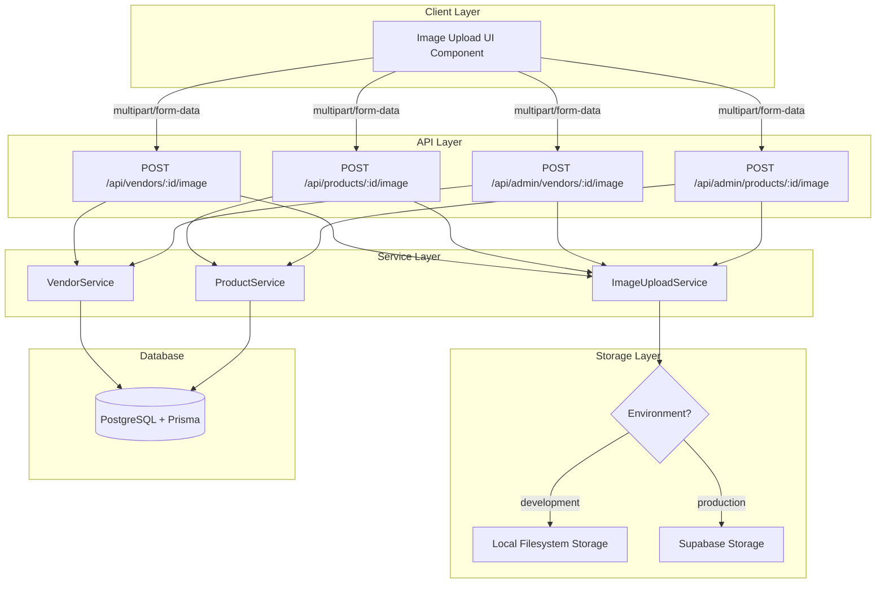
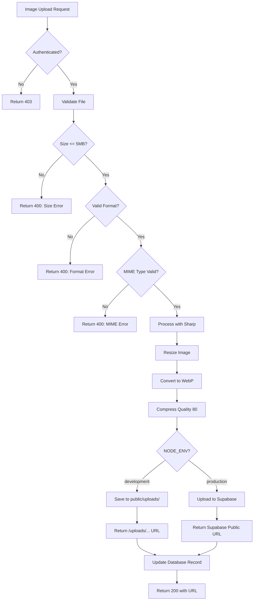
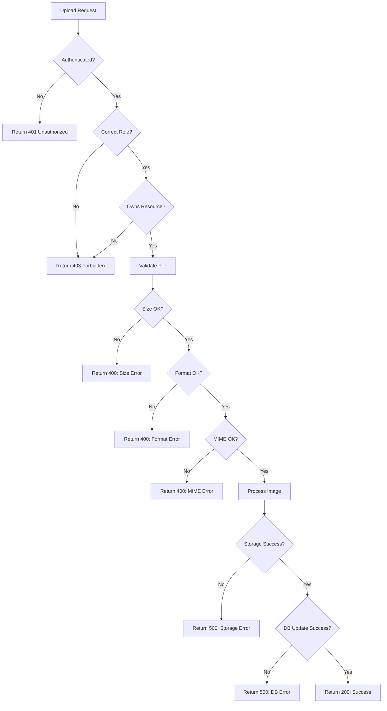

# Design Document: Vendor and Product Image Upload

## Overview

This design implements image upload functionality for vendor profiles and product listings in the multi-tenant marketplace platform. The system supports two storage strategies based on environment:

- **Development**: Local filesystem storage in `public/uploads/` directory
- **Production**: Supabase Storage with cloud-based object storage

All images are processed using `sharp` for optimization (resize, compress, WebP conversion) regardless of storage backend. The design ensures secure uploads, proper validation, role-based access control, and efficient image delivery.

### Key Design Decisions

1. **Environment-Based Storage Routing**: Service layer detects `NODE_ENV` and routes to appropriate storage implementation
2. **Unified Image Processing**: Both storage strategies use `sharp` for consistent image optimization
3. **WebP Conversion**: All images converted to WebP format for optimal compression and performance
4. **Responsive Sizing**: Vendor images resized to 800x800px, product images to 1200x1200px
5. **Secure Filenames**: UUID-based filenames prevent enumeration and path traversal attacks
6. **Atomic Operations**: New images stored before old references removed to prevent data loss

## Architecture

### High-Level Architecture



### Storage Strategy Flow



## Components and Interfaces

### 1. ImageUploadService

Core service handling image validation, processing, and storage routing.

```typescript
// src/services/image-upload.service.ts

import sharp from 'sharp';
import { createClient } from '@supabase/supabase-js';
import fs from 'fs/promises';
import path from 'path';
import { v4 as uuidv4 } from 'uuid';

export interface ImageUploadOptions {
  file: Buffer;
  filename: string;
  mimeType: string;
  type: 'vendor' | 'product';
}

export interface ImageUploadResult {
  url: string;
  size: number;
  format: string;
}


export class ImageUploadService {
  private static readonly MAX_FILE_SIZE = 5 * 1024 * 1024; // 5MB
  private static readonly SUPPORTED_FORMATS = ['image/jpeg', 'image/png', 'image/webp'];
  private static readonly VENDOR_SIZE = 800;
  private static readonly PRODUCT_SIZE = 1200;
  private static readonly QUALITY = 80;
  
  private static supabaseClient = process.env.NODE_ENV === 'production' 
    ? createClient(
        process.env.SUPABASE_URL!,
        process.env.SUPABASE_SERVICE_ROLE_KEY!
      )
    : null;

  /**
   * Main upload method - routes to appropriate storage based on environment
   */
  static async uploadImage(options: ImageUploadOptions): Promise<ImageUploadResult> {
    // Validate file
    this.validateFile(options);
    
    // Process image with sharp
    const processedBuffer = await this.processImage(options);
    
    // Route to appropriate storage
    if (process.env.NODE_ENV === 'production') {
      return await this.uploadToSupabase(processedBuffer, options.type);
    } else {
      return await this.saveToLocal(processedBuffer, options.type);
    }
  }

  /**
   * Validate file size, format, and MIME type
   */
  private static validateFile(options: ImageUploadOptions): void {
    // Check file size
    if (options.file.length > this.MAX_FILE_SIZE) {
      throw new Error('File size exceeds 5MB limit');
    }
    
    // Check MIME type
    if (!this.SUPPORTED_FORMATS.includes(options.mimeType)) {
      throw new Error('Only JPEG, PNG, and WebP formats are supported');
    }
    
    // Check for executable extensions
    const ext = path.extname(options.filename).toLowerCase();
    const dangerousExts = ['.exe', '.sh', '.bat', '.cmd', '.com'];
    if (dangerousExts.includes(ext)) {
      throw new Error('Invalid file type');
    }
  }


  /**
   * Process image: resize, convert to WebP, compress
   */
  private static async processImage(options: ImageUploadOptions): Promise<Buffer> {
    const targetSize = options.type === 'vendor' ? this.VENDOR_SIZE : this.PRODUCT_SIZE;
    
    return await sharp(options.file)
      .resize(targetSize, targetSize, {
        fit: 'inside',
        withoutEnlargement: true
      })
      .webp({ quality: this.QUALITY })
      .toBuffer();
  }

  /**
   * Save to local filesystem (development)
   */
  private static async saveToLocal(
    buffer: Buffer,
    type: 'vendor' | 'product'
  ): Promise<ImageUploadResult> {
    const filename = `${type}_${uuidv4()}.webp`;
    const uploadDir = path.join(process.cwd(), 'public', 'uploads', `${type}s`);
    const filePath = path.join(uploadDir, filename);
    
    // Ensure directory exists
    await fs.mkdir(uploadDir, { recursive: true });
    
    // Write file
    await fs.writeFile(filePath, buffer);
    
    return {
      url: `/uploads/${type}s/${filename}`,
      size: buffer.length,
      format: 'webp'
    };
  }

  /**
   * Upload to Supabase Storage (production)
   */
  private static async uploadToSupabase(
    buffer: Buffer,
    type: 'vendor' | 'product'
  ): Promise<ImageUploadResult> {
    if (!this.supabaseClient) {
      throw new Error('Supabase client not initialized');
    }
    
    const filename = `${type}s/${type}_${uuidv4()}.webp`;
    
    const { data, error } = await this.supabaseClient.storage
      .from('images')
      .upload(filename, buffer, {
        contentType: 'image/webp',
        cacheControl: '3600',
        upsert: false
      });
    
    if (error) {
      throw new Error(`Supabase upload failed: ${error.message}`);
    }
    
    // Get public URL
    const { data: urlData } = this.supabaseClient.storage
      .from('images')
      .getPublicUrl(filename);
    
    return {
      url: urlData.publicUrl,
      size: buffer.length,
      format: 'webp'
    };
  }


  /**
   * Delete image from storage (cleanup old images)
   */
  static async deleteImage(imageUrl: string, type: 'vendor' | 'product'): Promise<void> {
    if (process.env.NODE_ENV === 'production') {
      await this.deleteFromSupabase(imageUrl);
    } else {
      await this.deleteFromLocal(imageUrl);
    }
  }

  private static async deleteFromLocal(imageUrl: string): Promise<void> {
    try {
      const filePath = path.join(process.cwd(), 'public', imageUrl);
      await fs.unlink(filePath);
    } catch (error) {
      // Log but don't throw - file might already be deleted
      console.error('Failed to delete local file:', error);
    }
  }

  private static async deleteFromSupabase(imageUrl: string): Promise<void> {
    if (!this.supabaseClient) return;
    
    try {
      // Extract path from URL
      const url = new URL(imageUrl);
      const pathParts = url.pathname.split('/');
      const filename = pathParts.slice(-2).join('/'); // e.g., "vendors/vendor_uuid.webp"
      
      await this.supabaseClient.storage
        .from('images')
        .remove([filename]);
    } catch (error) {
      console.error('Failed to delete from Supabase:', error);
    }
  }
}
```

### 2. API Route Handlers

#### Vendor Image Upload (Vendor Role)

```typescript
// src/app/api/vendors/[id]/image/route.ts

import { NextRequest, NextResponse } from 'next/server';
import { withAuth } from '@/middleware/auth.middleware';
import { ImageUploadService } from '@/services/image-upload.service';
import { prisma } from '@/lib/prisma';

export const POST = withAuth(async (
  req: NextRequest,
  context: { params: { id: string }; user: any }
) => {
  try {
    const { id } = context.params;
    const { user } = context;
    
    // Verify vendor owns this profile
    if (user.role !== 'VENDOR' || user.vendorId !== id) {
      return NextResponse.json(
        { error: { code: 'FORBIDDEN', message: 'Not authorized to update this vendor profile' } },
        { status: 403 }
      );
    }

    
    // Parse multipart form data
    const formData = await req.formData();
    const file = formData.get('image') as File;
    
    if (!file) {
      return NextResponse.json(
        { error: { code: 'BAD_REQUEST', message: 'No image file provided' } },
        { status: 400 }
      );
    }
    
    // Convert File to Buffer
    const buffer = Buffer.from(await file.arrayBuffer());
    
    // Get current vendor to check for existing image
    const vendor = await prisma.vendor.findUnique({
      where: { id },
      select: { imageUrl: true }
    });
    
    if (!vendor) {
      return NextResponse.json(
        { error: { code: 'NOT_FOUND', message: 'Vendor not found' } },
        { status: 404 }
      );
    }
    
    // Upload new image
    const result = await ImageUploadService.uploadImage({
      file: buffer,
      filename: file.name,
      mimeType: file.type,
      type: 'vendor'
    });
    
    // Update vendor record
    await prisma.vendor.update({
      where: { id },
      data: { imageUrl: result.url }
    });
    
    // Delete old image if exists
    if (vendor.imageUrl) {
      await ImageUploadService.deleteImage(vendor.imageUrl, 'vendor');
    }
    
    return NextResponse.json({
      url: result.url,
      size: result.size,
      format: result.format
    }, { status: 200 });
    
  } catch (error: any) {
    if (error.message.includes('exceeds') || error.message.includes('format')) {
      return NextResponse.json(
        { error: { code: 'VALIDATION_ERROR', message: error.message } },
        { status: 400 }
      );
    }
    
    return NextResponse.json(
      { error: { code: 'INTERNAL_ERROR', message: 'Unable to save image. Please try again later' } },
      { status: 500 }
    );
  }
}, ['VENDOR']);
```


#### Product Image Upload (Vendor Role)

```typescript
// src/app/api/products/[id]/image/route.ts

import { NextRequest, NextResponse } from 'next/server';
import { withAuth } from '@/middleware/auth.middleware';
import { ImageUploadService } from '@/services/image-upload.service';
import { prisma } from '@/lib/prisma';

export const POST = withAuth(async (
  req: NextRequest,
  context: { params: { id: string }; user: any }
) => {
  try {
    const { id } = context.params;
    const { user } = context;
    
    // Get product and verify vendor ownership
    const product = await prisma.product.findUnique({
      where: { id },
      select: { vendorId: true, imageUrl: true }
    });
    
    if (!product) {
      return NextResponse.json(
        { error: { code: 'NOT_FOUND', message: 'Product not found' } },
        { status: 404 }
      );
    }
    
    if (user.role !== 'VENDOR' || user.vendorId !== product.vendorId) {
      return NextResponse.json(
        { error: { code: 'FORBIDDEN', message: 'Not authorized to update this product' } },
        { status: 403 }
      );
    }
    
    // Parse multipart form data
    const formData = await req.formData();
    const file = formData.get('image') as File;
    
    if (!file) {
      return NextResponse.json(
        { error: { code: 'BAD_REQUEST', message: 'No image file provided' } },
        { status: 400 }
      );
    }
    
    // Convert File to Buffer
    const buffer = Buffer.from(await file.arrayBuffer());
    
    // Upload new image
    const result = await ImageUploadService.uploadImage({
      file: buffer,
      filename: file.name,
      mimeType: file.type,
      type: 'product'
    });
    
    // Update product record
    await prisma.product.update({
      where: { id },
      data: { imageUrl: result.url }
    });
    
    // Delete old image if exists
    if (product.imageUrl) {
      await ImageUploadService.deleteImage(product.imageUrl, 'product');
    }
    
    return NextResponse.json({
      url: result.url,
      size: result.size,
      format: result.format
    }, { status: 200 });
    
  } catch (error: any) {
    if (error.message.includes('exceeds') || error.message.includes('format')) {
      return NextResponse.json(
        { error: { code: 'VALIDATION_ERROR', message: error.message } },
        { status: 400 }
      );
    }
    
    return NextResponse.json(
      { error: { code: 'INTERNAL_ERROR', message: 'Unable to save image. Please try again later' } },
      { status: 500 }
    );
  }
}, ['VENDOR']);
```


#### Admin Vendor Image Upload

```typescript
// src/app/api/admin/vendors/[id]/image/route.ts

import { NextRequest, NextResponse } from 'next/server';
import { withAuth } from '@/middleware/auth.middleware';
import { ImageUploadService } from '@/services/image-upload.service';
import { AuditLogService } from '@/services/audit-log.service';
import { prisma } from '@/lib/prisma';

export const POST = withAuth(async (
  req: NextRequest,
  context: { params: { id: string }; user: any }
) => {
  try {
    const { id } = context.params;
    const { user } = context;
    
    // Get current vendor
    const vendor = await prisma.vendor.findUnique({
      where: { id },
      select: { imageUrl: true, businessName: true }
    });
    
    if (!vendor) {
      return NextResponse.json(
        { error: { code: 'NOT_FOUND', message: 'Vendor not found' } },
        { status: 404 }
      );
    }
    
    // Parse multipart form data
    const formData = await req.formData();
    const file = formData.get('image') as File;
    
    if (!file) {
      return NextResponse.json(
        { error: { code: 'BAD_REQUEST', message: 'No image file provided' } },
        { status: 400 }
      );
    }
    
    // Convert File to Buffer
    const buffer = Buffer.from(await file.arrayBuffer());
    
    // Upload new image
    const result = await ImageUploadService.uploadImage({
      file: buffer,
      filename: file.name,
      mimeType: file.type,
      type: 'vendor'
    });
    
    // Update vendor record
    await prisma.vendor.update({
      where: { id },
      data: { imageUrl: result.url }
    });
    
    // Log admin action
    await AuditLogService.log({
      userId: user.id,
      action: 'UPDATE_VENDOR_IMAGE',
      entityType: 'VENDOR',
      entityId: id,
      details: {
        businessName: vendor.businessName,
        oldImageUrl: vendor.imageUrl,
        newImageUrl: result.url
      }
    });
    
    // Delete old image if exists
    if (vendor.imageUrl) {
      await ImageUploadService.deleteImage(vendor.imageUrl, 'vendor');
    }
    
    return NextResponse.json({
      url: result.url,
      size: result.size,
      format: result.format
    }, { status: 200 });
    
  } catch (error: any) {
    if (error.message.includes('exceeds') || error.message.includes('format')) {
      return NextResponse.json(
        { error: { code: 'VALIDATION_ERROR', message: error.message } },
        { status: 400 }
      );
    }
    
    return NextResponse.json(
      { error: { code: 'INTERNAL_ERROR', message: 'Unable to save image. Please try again later' } },
      { status: 500 }
    );
  }
}, ['SUPER_ADMIN']);
```


#### Admin Product Image Upload

```typescript
// src/app/api/admin/products/[id]/image/route.ts

import { NextRequest, NextResponse } from 'next/server';
import { withAuth } from '@/middleware/auth.middleware';
import { ImageUploadService } from '@/services/image-upload.service';
import { AuditLogService } from '@/services/audit-log.service';
import { prisma } from '@/lib/prisma';

export const POST = withAuth(async (
  req: NextRequest,
  context: { params: { id: string }; user: any }
) => {
  try {
    const { id } = context.params;
    const { user } = context;
    
    // Get current product
    const product = await prisma.product.findUnique({
      where: { id },
      select: { imageUrl: true, name: true }
    });
    
    if (!product) {
      return NextResponse.json(
        { error: { code: 'NOT_FOUND', message: 'Product not found' } },
        { status: 404 }
      );
    }
    
    // Parse multipart form data
    const formData = await req.formData();
    const file = formData.get('image') as File;
    
    if (!file) {
      return NextResponse.json(
        { error: { code: 'BAD_REQUEST', message: 'No image file provided' } },
        { status: 400 }
      );
    }
    
    // Convert File to Buffer
    const buffer = Buffer.from(await file.arrayBuffer());
    
    // Upload new image
    const result = await ImageUploadService.uploadImage({
      file: buffer,
      filename: file.name,
      mimeType: file.type,
      type: 'product'
    });
    
    // Update product record
    await prisma.product.update({
      where: { id },
      data: { imageUrl: result.url }
    });
    
    // Log admin action
    await AuditLogService.log({
      userId: user.id,
      action: 'UPDATE_PRODUCT_IMAGE',
      entityType: 'PRODUCT',
      entityId: id,
      details: {
        productName: product.name,
        oldImageUrl: product.imageUrl,
        newImageUrl: result.url
      }
    });
    
    // Delete old image if exists
    if (product.imageUrl) {
      await ImageUploadService.deleteImage(product.imageUrl, 'product');
    }
    
    return NextResponse.json({
      url: result.url,
      size: result.size,
      format: result.format
    }, { status: 200 });
    
  } catch (error: any) {
    if (error.message.includes('exceeds') || error.message.includes('format')) {
      return NextResponse.json(
        { error: { code: 'VALIDATION_ERROR', message: error.message } },
        { status: 400 }
      );
    }
    
    return NextResponse.json(
      { error: { code: 'INTERNAL_ERROR', message: 'Unable to save image. Please try again later' } },
      { status: 500 }
    );
  }
}, ['SUPER_ADMIN']);
```

### 3. UI Components

#### ImageUpload Component

```typescript
// src/components/ImageUpload.tsx

'use client';

import { useState, useRef } from 'react';
import { Upload, X, Loader2 } from 'lucide-react';
import { Button } from '@/components/ui/button';
import Image from 'next/image';

interface ImageUploadProps {
  currentImageUrl?: string | null;
  onUploadSuccess: (url: string) => void;
  uploadEndpoint: string;
  type: 'vendor' | 'product';
  alt: string;
}

export function ImageUpload({
  currentImageUrl,
  onUploadSuccess,
  uploadEndpoint,
  type,
  alt
}: ImageUploadProps) {
  const [preview, setPreview] = useState<string | null>(currentImageUrl || null);
  const [isUploading, setIsUploading] = useState(false);
  const [error, setError] = useState<string | null>(null);
  const [selectedFile, setSelectedFile] = useState<File | null>(null);
  const fileInputRef = useRef<HTMLInputElement>(null);

  const handleFileSelect = (e: React.ChangeEvent<HTMLInputElement>) => {
    const file = e.target.files?.[0];
    if (!file) return;

    // Clear previous error
    setError(null);

    // Validate file size
    if (file.size > 5 * 1024 * 1024) {
      setError('File size exceeds 5MB limit');
      return;
    }

    // Validate file type
    const validTypes = ['image/jpeg', 'image/png', 'image/webp'];
    if (!validTypes.includes(file.type)) {
      setError('Only JPEG, PNG, and WebP formats are supported');
      return;
    }

    setSelectedFile(file);

    // Create preview
    const reader = new FileReader();
    reader.onloadend = () => {
      setPreview(reader.result as string);
    };
    reader.readAsDataURL(file);
  };

  const handleUpload = async () => {
    if (!selectedFile) return;

    setIsUploading(true);
    setError(null);

    try {
      const formData = new FormData();
      formData.append('image', selectedFile);

      const response = await fetch(uploadEndpoint, {
        method: 'POST',
        body: formData,
        credentials: 'include'
      });

      if (!response.ok) {
        const errorData = await response.json();
        throw new Error(errorData.error?.message || 'Upload failed');
      }

      const data = await response.json();
      onUploadSuccess(data.url);
      setPreview(data.url);
      setSelectedFile(null);
    } catch (err: any) {
      setError(err.message || 'Upload failed. Please check your connection and try again');
    } finally {
      setIsUploading(false);
    }
  };

  const handleRemove = () => {
    setPreview(null);
    setSelectedFile(null);
    setError(null);
    if (fileInputRef.current) {
      fileInputRef.current.value = '';
    }
  };

  const size = type === 'vendor' ? 200 : 300;

  return (
    <div className="space-y-4">
      <div className="flex flex-col items-center gap-4">
        {preview ? (
          <div className="relative group">
            <Image
              src={preview}
              alt={alt}
              width={size}
              height={size}
              className="rounded-lg object-cover border-2 border-gray-200"
            />
            <div className="absolute inset-0 bg-black bg-opacity-50 opacity-0 group-hover:opacity-100 transition-opacity rounded-lg flex items-center justify-center">
              <Button
                type="button"
                variant="destructive"
                size="sm"
                onClick={handleRemove}
                disabled={isUploading}
              >
                <X className="h-4 w-4 mr-2" />
                Remove
              </Button>
            </div>
          </div>
        ) : (
          <div
            className="border-2 border-dashed border-gray-300 rounded-lg flex items-center justify-center cursor-pointer hover:border-gray-400 transition-colors"
            style={{ width: size, height: size }}
            onClick={() => fileInputRef.current?.click()}
          >
            <div className="text-center p-4">
              <Upload className="h-8 w-8 mx-auto text-gray-400 mb-2" />
              <p className="text-sm text-gray-600">Click to upload</p>
              <p className="text-xs text-gray-400 mt-1">Max 5MB</p>
            </div>
          </div>
        )}

        <input
          ref={fileInputRef}
          type="file"
          accept="image/jpeg,image/png,image/webp"
          onChange={handleFileSelect}
          className="hidden"
        />

        {selectedFile && !isUploading && (
          <Button onClick={handleUpload} type="button">
            Upload Image
          </Button>
        )}

        {isUploading && (
          <div className="flex items-center gap-2 text-sm text-gray-600">
            <Loader2 className="h-4 w-4 animate-spin" />
            Uploading...
          </div>
        )}

        {error && (
          <div className="text-sm text-red-600 bg-red-50 px-4 py-2 rounded">
            {error}
          </div>
        )}

        {!error && !isUploading && selectedFile && (
          <p className="text-sm text-green-600">Image uploaded successfully</p>
        )}
      </div>

      <div className="text-xs text-gray-500 space-y-1">
        <p>• Supported formats: JPEG, PNG, WebP</p>
        <p>• Maximum file size: 5MB</p>
        <p>• Images will be optimized automatically</p>
      </div>
    </div>
  );
}
```


## Data Models

### Database Schema Updates

```prisma
// prisma/schema.prisma

model Vendor {
  id              String   @id @default(uuid())
  userId          String   @unique
  businessName    String
  businessAddress String
  phone           String
  imageUrl        String?  // NEW FIELD
  // ... existing fields
  createdAt       DateTime @default(now())
  updatedAt       DateTime @updatedAt
}

model Product {
  id          String   @id @default(uuid())
  vendorId    String
  name        String
  description String
  price       Decimal  @db.Decimal(10, 2)
  imageUrl    String?  // NEW FIELD
  // ... existing fields
  createdAt   DateTime @default(now())
  updatedAt   DateTime @updatedAt
}
```

### Migration Script

```sql
-- Add imageUrl columns
ALTER TABLE "Vendor" ADD COLUMN "imageUrl" TEXT;
ALTER TABLE "Product" ADD COLUMN "imageUrl" TEXT;
```

### TypeScript Types

```typescript
// Generated by Prisma
export type Vendor = {
  id: string;
  userId: string;
  businessName: string;
  businessAddress: string;
  phone: string;
  imageUrl: string | null;
  createdAt: Date;
  updatedAt: Date;
};

export type Product = {
  id: string;
  vendorId: string;
  name: string;
  description: string;
  price: Decimal;
  imageUrl: string | null;
  createdAt: Date;
  updatedAt: Date;
};
```

## Correctness Properties

*A property is a characteristic or behavior that should hold true across all valid executions of a system—essentially, a formal statement about what the system should do. Properties serve as the bridge between human-readable specifications and machine-verifiable correctness guarantees.*

Before defining the correctness properties, let me analyze the acceptance criteria from the requirements document:


### Property Reflection

After analyzing all acceptance criteria, I identified the following redundancies:

1. **Format validation (1.2, 2.2, 3.1)**: All test the same behavior - can be combined into one property
2. **Size validation (1.3, 2.3, 3.3)**: All test the same behavior - can be combined into one property
3. **Storage and URL return (1.4, 2.4)**: Same behavior for both types - can be combined
4. **Database persistence (1.5, 2.5)**: Same pattern for vendors and products - can be combined
5. **Image replacement (1.7, 2.7)**: Same behavior for both types - can be combined
6. **MIME type validation (3.2, 9.1)**: Same validation - can be combined
7. **Invalid format rejection (3.4)**: Covered by format validation property
8. **Authorization (5.3, 5.8)**: Can be combined into one comprehensive authorization property
9. **Filename security (9.3, 9.6)**: Both about secure filename generation - can be combined

After consolidation, we have 26 unique, non-redundant properties.

### Correctness Properties

**Property 1: Format Validation**
*For any* uploaded file, the system should accept the file if and only if its format is JPEG, PNG, or WebP
**Validates: Requirements 1.2, 2.2, 3.1, 3.4**

**Property 2: Size Validation**
*For any* uploaded file, the system should accept the file if and only if its size is less than or equal to 5MB
**Validates: Requirements 1.3, 2.3, 3.3**

**Property 3: Storage and URL Return**
*For any* valid image upload (vendor or product), the storage service should store the image and return a publicly accessible URL
**Validates: Requirements 1.4, 2.4**

**Property 4: Database Persistence**
*For any* successful image upload, the system should save the returned URL to the corresponding database record (Vendor or Product)
**Validates: Requirements 1.5, 2.5**

**Property 5: Image Replacement**
*For any* entity (vendor or product) with an existing image, uploading a new image should replace the old imageUrl with the new URL in the database
**Validates: Requirements 1.7, 2.7**

**Property 6: MIME Type Validation**
*For any* uploaded file, the system should verify that the MIME type matches the file extension and reject mismatches
**Validates: Requirements 3.2, 9.1**

**Property 7: State Preservation on Failure**
*For any* invalid file upload attempt, the system should maintain the current imageUrl value without modification
**Validates: Requirements 3.5**

**Property 8: Unique Filename Generation**
*For any* two image uploads, the generated filenames should be unique (non-guessable and collision-free)
**Validates: Requirements 4.1, 9.3**

**Property 9: Complete Metadata Return**
*For any* successful image upload, the response should include complete metadata: URL, file size, and format
**Validates: Requirements 4.2**

**Property 10: URL Accessibility**
*For any* stored image, the returned URL should be publicly accessible and serve the image content
**Validates: Requirements 4.3**

**Property 11: Atomic Replacement**
*For any* image replacement operation, the new image should be stored successfully before the old image reference is removed
**Validates: Requirements 4.4**

**Property 12: HTTPS Protocol**
*For any* stored image in production, the returned URL should use the HTTPS protocol
**Validates: Requirements 4.5**

**Property 13: Authorization Enforcement**
*For any* upload request, the system should verify the user has appropriate role (VENDOR for vendor/product uploads, SUPER_ADMIN for admin uploads) and return 403 for unauthorized users
**Validates: Requirements 5.3, 5.8, 9.5**

**Property 14: Content Type Acceptance**
*For any* upload request with multipart/form-data content type, the system should accept and process the request
**Validates: Requirements 5.4**

**Property 15: Success Response Format**
*For any* successful upload, the system should return HTTP 200 status with a response body containing the image URL
**Validates: Requirements 5.5**

**Property 16: Validation Error Response**
*For any* upload that fails validation (size or format), the system should return HTTP 400 status with error details
**Validates: Requirements 5.6**

**Property 17: Query Response Completeness**
*For any* Vendor or Product record query, the response should include the imageUrl field (null or string value)
**Validates: Requirements 7.4**

**Property 18: Executable Extension Rejection**
*For any* file with an executable extension (.exe, .sh, .bat, .cmd, .com), the system should reject the upload regardless of MIME type
**Validates: Requirements 9.2**

**Property 19: Ownership Verification**
*For any* vendor uploading an image, the system should verify the vendor owns the resource (vendor profile or product) being updated
**Validates: Requirements 9.5**

**Property 20: Filename Sanitization**
*For any* uploaded file, the generated filename should not contain path traversal sequences (../) or special characters that could cause security issues
**Validates: Requirements 9.6**

**Property 21: Image Compression**
*For any* uploaded image, the processed image should be compressed (output size should be less than or equal to input size while maintaining quality)
**Validates: Requirements 11.1**

**Property 22: Image Resizing**
*For any* uploaded vendor image, the processed image should be resized to fit within 800x800 pixels
**Validates: Requirements 11.2**

**Property 23: Product Image Resizing**
*For any* uploaded product image, the processed image should be resized to fit within 1200x1200 pixels
**Validates: Requirements 11.2**

**Property 24: WebP Conversion**
*For any* uploaded image (regardless of input format), the stored image should be in WebP format
**Validates: Requirements 11.3**

**Property 25: Environment-Based Storage Routing**
*For any* image upload in development environment, the image should be stored in local filesystem at public/uploads/
**Validates: Requirements 4.1, 4.3**

**Property 26: Production Storage Routing**
*For any* image upload in production environment, the image should be uploaded to Supabase Storage and return a Supabase public URL
**Validates: Requirements 4.1, 4.3**


## Error Handling

### Validation Errors

```typescript
export class ValidationError extends Error {
  constructor(message: string) {
    super(message);
    this.name = 'ValidationError';
  }
}

// Usage in ImageUploadService
if (options.file.length > this.MAX_FILE_SIZE) {
  throw new ValidationError('File size exceeds 5MB limit');
}

if (!this.SUPPORTED_FORMATS.includes(options.mimeType)) {
  throw new ValidationError('Only JPEG, PNG, and WebP formats are supported');
}
```

### Storage Errors

```typescript
export class StorageError extends Error {
  constructor(message: string, public originalError?: Error) {
    super(message);
    this.name = 'StorageError';
  }
}

// Usage in ImageUploadService
try {
  await fs.writeFile(filePath, buffer);
} catch (error) {
  throw new StorageError('Failed to save image to local storage', error as Error);
}
```

### Authorization Errors

```typescript
// Handled by withAuth middleware
// Returns 403 for unauthorized users
// Returns 401 for unauthenticated requests
```

### Error Response Format

All API endpoints return errors in a consistent format:

```typescript
{
  error: {
    code: 'VALIDATION_ERROR' | 'STORAGE_ERROR' | 'FORBIDDEN' | 'NOT_FOUND' | 'INTERNAL_ERROR',
    message: string
  }
}
```

### Error Handling Flow



## Testing Strategy

### Dual Testing Approach

This feature requires both unit tests and property-based tests for comprehensive coverage:

- **Unit Tests**: Verify specific examples, edge cases, and integration points
- **Property Tests**: Verify universal properties across all inputs using fast-check

### Property-Based Testing Configuration

**Library**: fast-check (already in tech stack)

**Configuration**:
- Minimum 100 iterations per property test
- Each test tagged with feature name and property number
- Tag format: `Feature: vendor-product-image-upload, Property {N}: {property description}`

**Example Property Test Structure**:

```typescript
// __tests__/image-upload.property.test.ts

import * as fc from 'fast-check';
import { ImageUploadService } from '@/services/image-upload.service';

describe('Image Upload Property Tests', () => {
  // Feature: vendor-product-image-upload, Property 1: Format Validation
  it('should accept only JPEG, PNG, or WebP formats', async () => {
    await fc.assert(
      fc.asyncProperty(
        fc.oneof(
          fc.constant('image/jpeg'),
          fc.constant('image/png'),
          fc.constant('image/webp'),
          fc.constant('image/gif'),
          fc.constant('image/bmp'),
          fc.constant('application/pdf')
        ),
        fc.uint8Array({ minLength: 100, maxLength: 1000 }),
        async (mimeType, fileBuffer) => {
          const validFormats = ['image/jpeg', 'image/png', 'image/webp'];
          const buffer = Buffer.from(fileBuffer);
          
          try {
            await ImageUploadService.uploadImage({
              file: buffer,
              filename: 'test.jpg',
              mimeType,
              type: 'vendor'
            });
            
            // Should only succeed for valid formats
            expect(validFormats).toContain(mimeType);
          } catch (error: any) {
            // Should only fail for invalid formats
            if (error.message.includes('format')) {
              expect(validFormats).not.toContain(mimeType);
            }
          }
        }
      ),
      { numRuns: 100 }
    );
  });

  // Feature: vendor-product-image-upload, Property 2: Size Validation
  it('should accept files <= 5MB and reject files > 5MB', async () => {
    await fc.assert(
      fc.asyncProperty(
        fc.integer({ min: 1, max: 10 * 1024 * 1024 }), // 1 byte to 10MB
        async (fileSize) => {
          const buffer = Buffer.alloc(fileSize);
          const maxSize = 5 * 1024 * 1024;
          
          try {
            await ImageUploadService.uploadImage({
              file: buffer,
              filename: 'test.jpg',
              mimeType: 'image/jpeg',
              type: 'vendor'
            });
            
            // Should only succeed for files <= 5MB
            expect(fileSize).toBeLessThanOrEqual(maxSize);
          } catch (error: any) {
            // Should only fail for files > 5MB
            if (error.message.includes('exceeds')) {
              expect(fileSize).toBeGreaterThan(maxSize);
            }
          }
        }
      ),
      { numRuns: 100 }
    );
  });

  // Feature: vendor-product-image-upload, Property 8: Unique Filename Generation
  it('should generate unique filenames for all uploads', async () => {
    const filenames = new Set<string>();
    
    await fc.assert(
      fc.asyncProperty(
        fc.uint8Array({ minLength: 100, maxLength: 1000 }),
        async (fileBuffer) => {
          const buffer = Buffer.from(fileBuffer);
          
          const result = await ImageUploadService.uploadImage({
            file: buffer,
            filename: 'test.jpg',
            mimeType: 'image/jpeg',
            type: 'vendor'
          });
          
          // Extract filename from URL
          const filename = result.url.split('/').pop()!;
          
          // Should not have seen this filename before
          expect(filenames.has(filename)).toBe(false);
          filenames.add(filename);
        }
      ),
      { numRuns: 100 }
    );
  });
});
```

### Unit Testing Focus

Unit tests should cover:

1. **Specific Examples**:
   - Upload a valid JPEG vendor image
   - Upload a valid PNG product image
   - Replace an existing image

2. **Edge Cases**:
   - Upload exactly 5MB file (boundary)
   - Upload 1 byte file (minimum)
   - Upload image with special characters in filename
   - Upload image with no extension

3. **Integration Points**:
   - API route authentication flow
   - Database transaction handling
   - Supabase client initialization
   - File system operations

4. **Error Conditions**:
   - Network timeout during upload
   - Database connection failure
   - Insufficient disk space
   - Invalid Supabase credentials

### Test File Organization

```
__tests__/
├── services/
│   ├── image-upload.service.test.ts        # Unit tests
│   └── image-upload.service.property.test.ts # Property tests
├── api/
│   ├── vendors-image-upload.test.ts        # API unit tests
│   └── products-image-upload.test.ts       # API unit tests
└── components/
    └── ImageUpload.test.tsx                # Component tests
```

### Mock Strategy

For unit tests, mock external dependencies:

```typescript
jest.mock('@supabase/supabase-js');
jest.mock('fs/promises');
jest.mock('sharp');

// Mock Supabase client
const mockSupabaseClient = {
  storage: {
    from: jest.fn().mockReturnValue({
      upload: jest.fn(),
      getPublicUrl: jest.fn(),
      remove: jest.fn()
    })
  }
};
```

For property tests, use real implementations where possible to catch integration issues.

## Dependencies

### New Dependencies

```json
{
  "dependencies": {
    "@supabase/supabase-js": "^2.39.0",
    "sharp": "^0.33.0",
    "uuid": "^9.0.1"
  },
  "devDependencies": {
    "@types/uuid": "^9.0.7"
  }
}
```

### Installation

```bash
npm install @supabase/supabase-js sharp uuid
npm install --save-dev @types/uuid
```

## Environment Variables

### Development (.env.local)

```bash
# No additional variables needed for local storage
NODE_ENV=development
```

### Production (.env.production)

```bash
NODE_ENV=production

# Supabase Configuration
SUPABASE_URL=https://your-project.supabase.co
SUPABASE_SERVICE_ROLE_KEY=your-service-role-key
```

### Environment Variable Validation

```typescript
// src/lib/env.ts

import { z } from 'zod';

const envSchema = z.object({
  NODE_ENV: z.enum(['development', 'production', 'test']),
  SUPABASE_URL: z.string().url().optional(),
  SUPABASE_SERVICE_ROLE_KEY: z.string().optional()
}).refine(
  (data) => {
    // In production, Supabase credentials are required
    if (data.NODE_ENV === 'production') {
      return data.SUPABASE_URL && data.SUPABASE_SERVICE_ROLE_KEY;
    }
    return true;
  },
  {
    message: 'SUPABASE_URL and SUPABASE_SERVICE_ROLE_KEY are required in production'
  }
);

export const env = envSchema.parse(process.env);
```

## Supabase Storage Configuration

### Bucket Setup

1. Create a bucket named `images` in Supabase Storage
2. Set bucket to public (for public URL access)
3. Configure CORS if needed for direct browser uploads

### Bucket Policies

```sql
-- Allow public read access
CREATE POLICY "Public Access"
ON storage.objects FOR SELECT
USING (bucket_id = 'images');

-- Allow authenticated uploads (service role)
CREATE POLICY "Authenticated Upload"
ON storage.objects FOR INSERT
WITH CHECK (bucket_id = 'images');

-- Allow authenticated deletes (service role)
CREATE POLICY "Authenticated Delete"
ON storage.objects FOR DELETE
USING (bucket_id = 'images');
```

### Folder Structure in Supabase

```
images/
├── vendors/
│   ├── vendor_uuid1.webp
│   ├── vendor_uuid2.webp
│   └── ...
└── products/
    ├── product_uuid1.webp
    ├── product_uuid2.webp
    └── ...
```

## Performance Considerations

### Image Processing

- Sharp is highly optimized and uses libvips for fast image processing
- Processing time: ~50-200ms for typical images
- Memory usage: ~2-3x the input file size during processing

### Storage Performance

**Local Storage**:
- Write speed: Limited by disk I/O (~100-500 MB/s on SSD)
- No network latency
- Suitable for development

**Supabase Storage**:
- Upload speed: Limited by network bandwidth
- Typical latency: 100-500ms depending on region
- CDN-backed for fast delivery
- Automatic backups and redundancy

### Optimization Strategies

1. **Async Processing**: All image operations are async to avoid blocking
2. **Streaming**: Use streams for large file handling (future enhancement)
3. **Caching**: Browser caching via cache headers (3600s)
4. **Lazy Loading**: Use Next.js Image component for lazy loading
5. **Progressive Enhancement**: Show preview before upload completes

## Security Considerations

### File Validation

1. **Extension Check**: Verify file extension matches allowed formats
2. **MIME Type Check**: Verify MIME type matches extension
3. **Content Verification**: Sharp validates image content during processing
4. **Executable Rejection**: Explicitly reject executable extensions

### Filename Security

1. **UUID Generation**: Use UUID v4 for non-guessable filenames
2. **Path Traversal Prevention**: Generated filenames don't use user input
3. **Special Character Removal**: Sanitize any user-provided metadata

### Access Control

1. **Authentication**: All endpoints require authentication via withAuth
2. **Authorization**: Role-based access control (VENDOR, SUPER_ADMIN)
3. **Ownership Verification**: Vendors can only upload to their own resources
4. **Rate Limiting**: Prevent abuse via rate-limit middleware

### Storage Security

**Local Storage**:
- Files stored in public directory (accessible via web server)
- No additional authentication needed for serving
- Suitable for development only

**Supabase Storage**:
- Service role key used for uploads (server-side only)
- Public bucket for read access
- HTTPS enforced
- Row-level security policies

## Migration Guide

### Database Migration

```bash
# Generate migration
npm run db:migrate -- --name add_image_urls

# Apply migration
npm run db:push
```

### Supabase Setup (Production Only)

1. Create Supabase project at https://supabase.com
2. Navigate to Storage section
3. Create bucket named `images`
4. Set bucket to public
5. Copy project URL and service role key to .env.production

### Deployment Checklist

- [ ] Install new dependencies (sharp, @supabase/supabase-js, uuid)
- [ ] Run database migration
- [ ] Set environment variables in production
- [ ] Create Supabase bucket and configure policies
- [ ] Test image upload in staging environment
- [ ] Verify HTTPS URLs in production
- [ ] Monitor storage usage and costs

## Future Enhancements

1. **Multiple Image Sizes**: Generate thumbnail, medium, and large versions
2. **Image Cropping**: Allow vendors to crop images before upload
3. **Bulk Upload**: Support uploading multiple images at once
4. **Image Gallery**: Support multiple images per product
5. **Image Moderation**: AI-based content moderation for inappropriate images
6. **CDN Integration**: Add CloudFront or similar CDN for faster delivery
7. **Image Analytics**: Track image views and performance
8. **Lazy Loading**: Implement progressive image loading
9. **Image Optimization**: Automatic format selection (WebP, AVIF) based on browser support
10. **Direct Browser Upload**: Allow direct uploads to Supabase from browser (signed URLs)
